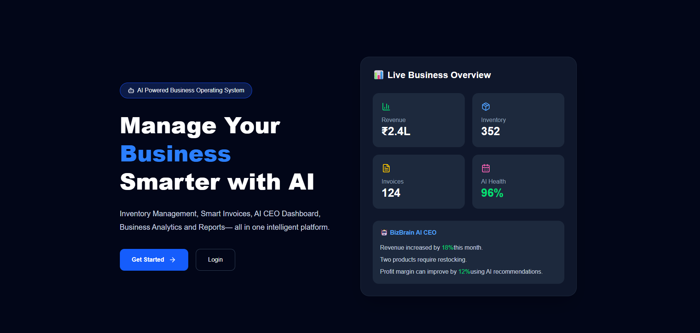
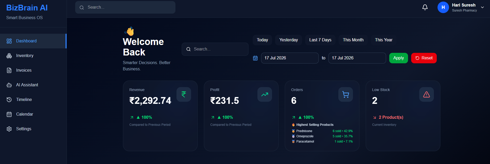
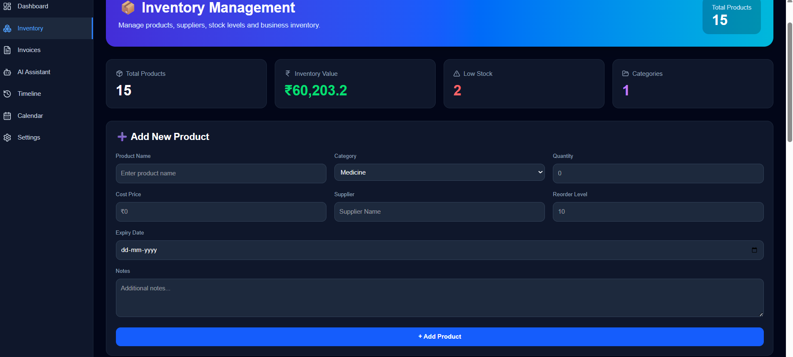
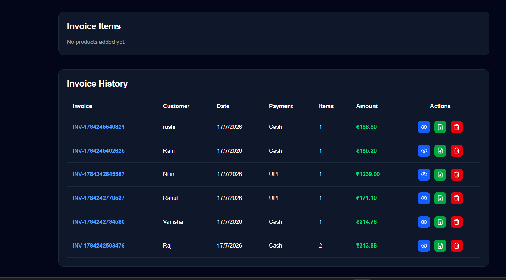
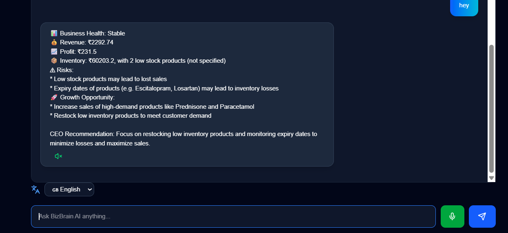
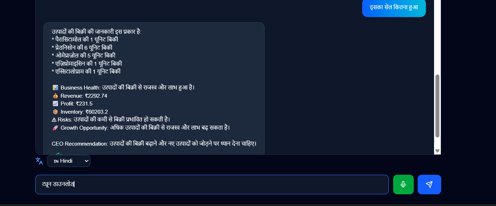
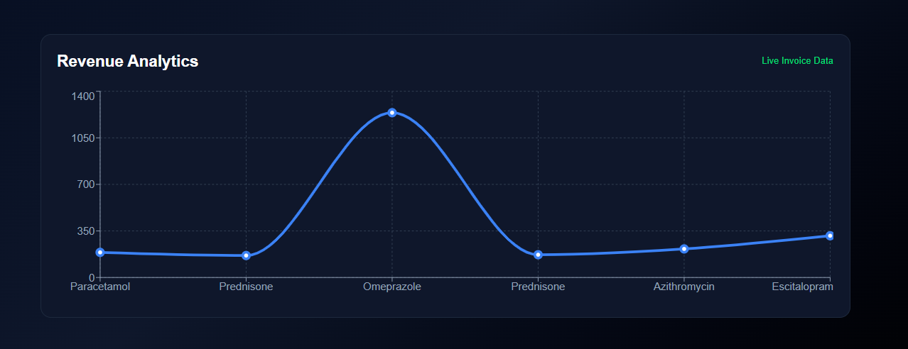
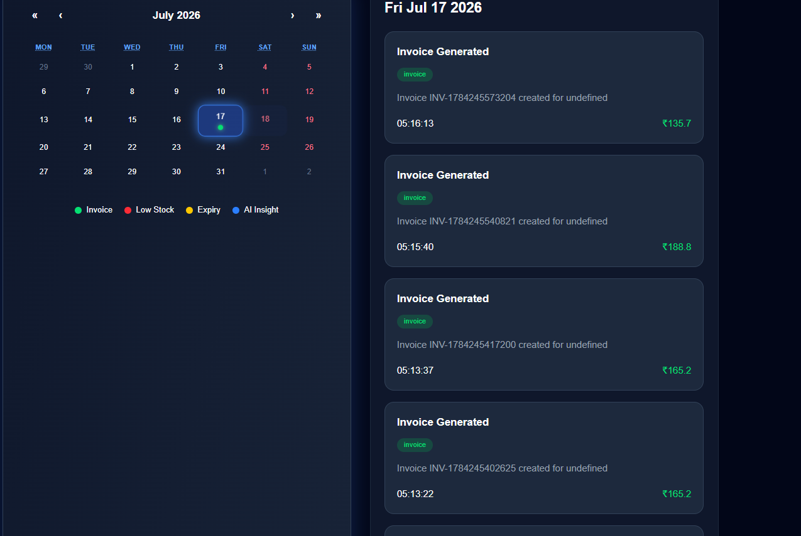

<div align="center">

# 🚀 BizBrain AI

### AI-Powered Business Operating System for MSMEs

### *Manage • Analyze • Decide • Grow with Artificial Intelligence*


---

# 📖 About BizBrain AI

BizBrain AI is an **AI-powered Business Operating System** specially designed for **Micro, Small and Medium Enterprises (MSMEs).**

Unlike traditional inventory or billing software, BizBrain AI combines **Inventory Management, Invoice Generation, Revenue Analytics, Artificial Intelligence, Voice Assistant, Historical Dashboard and CEO Recommendations** into one intelligent platform.

Our goal is simple:

> **Help every business owner make smarter business decisions using Artificial Intelligence.**
# ❗ Problem Statement

Small and medium-sized businesses (MSMEs) often rely on notebooks, spreadsheets, or multiple disconnected software tools to manage their daily operations. While these methods record business data, they do not help owners understand or improve their business performance.

As a result, business owners face several challenges:

- 📦 Difficulty managing inventory efficiently
- 🧾 Time-consuming invoice creation
- 📉 Lack of sales and profit insights
- ⚠️ Poor stock management leading to overstocking or stock shortages
- 📊 No centralized dashboard for business monitoring
- 🤔 Business decisions based on guesswork instead of data
- ⏳ Manual work that consumes valuable business time

Most existing solutions focus on storing business data rather than helping business owners make better decisions.

---

# 💡 Our Solution

BizBrain AI transforms traditional business management into an intelligent, AI-powered experience.

Instead of simply recording inventory and invoices, BizBrain AI continuously analyzes business data and provides actionable insights through an intuitive dashboard and AI assistant.

The platform combines multiple business operations into one unified system, enabling business owners to manage their entire business from a single interface.

With BizBrain AI, users can:

- 📦 Manage inventory effortlessly
- 🧾 Generate professional invoices
- 📊 Monitor business performance in real time
- 🤖 Ask business-related questions using AI
- 🎙 Interact through voice commands
- 🌍 Use the application in multiple languages
- 📅 Analyze historical business performance
- 🧠 Receive intelligent business recommendations

---

# 🎯 Our Mission

Our mission is to make Artificial Intelligence accessible to every small business.

We believe that advanced business intelligence should not be limited to large enterprises with expensive software.

BizBrain AI empowers shop owners, retailers, wholesalers, pharmacies, grocery stores, electronics shops, clothing stores, and many other businesses with AI-driven decision-making that is simple, affordable, and easy to use.

---

# 🌟 Why BizBrain AI?

Unlike traditional inventory or billing software, BizBrain AI acts as an intelligent business partner.

Instead of only showing reports, it helps business owners understand their business, identify opportunities, reduce risks, and make smarter decisions using Artificial Intelligence.

Our vision is simple:

> **"Every small business deserves its own AI Business Advisor."**
# ✨ Key Features

BizBrain AI is designed to simplify business management while providing intelligent insights through Artificial Intelligence.

---

## 📦 Smart Inventory Management

Efficiently manage your inventory with an easy-to-use interface.

### Features

- ➕ Add New Products
- ✏️ Edit Existing Products
- 🗑️ Delete Products
- 📂 Category Management
- 🏢 Supplier Information
- 💰 Cost Price & Selling Price Tracking
- 📊 Inventory Value Calculation
- 🔍 Instant Product Search
- ⚠️ Low Stock Alerts

**Benefits**

✔ Better inventory organization

✔ Reduce stock shortages

✔ Prevent overstocking

✔ Improve inventory visibility

---

## 🧾 Smart Invoice Management

Generate professional invoices within seconds.

### Features

- Professional Invoice Generator
- Customer Information Management
- Automatic Revenue Calculation
- Automatic Profit Calculation
- GST Support
- Invoice History
- PDF Invoice Download
- Automatic Dashboard Update

**Benefits**

✔ Faster billing

✔ Accurate calculations

✔ Better customer management

✔ Professional invoice generation

---

## 📊 Intelligent Business Dashboard

Monitor your business performance in real time through an interactive dashboard.

Dashboard includes:

- 💰 Total Revenue
- 📈 Total Profit
- 📦 Inventory Value
- 🛒 Total Orders
- ⚠️ Low Stock Products
- 📊 Revenue Analytics
- 📈 Product Performance
- 🤖 AI Business Summary
- 🧠 CEO Recommendations

Every invoice generated updates the dashboard automatically.

---

## 📈 Revenue Analytics

Interactive charts help business owners understand their sales performance.

### Includes

- Revenue Analytics
- Product-wise Revenue
- Best Selling Products
- Business Performance Trends

Hover over the chart to instantly view:

- 📦 Product Name
- 💰 Revenue
- 📅 Date
- 🕒 Time

This makes business analysis simple and visually appealing.

---

## 🤖 AI Business Assistant

Powered by **Groq LLM**, BizBrain AI acts as a virtual business advisor.

Users can ask questions like:

- Which product generated the highest revenue?
- Which product gives the highest profit?
- Which products should I restock?
- Why is my revenue decreasing?
- Give today's business summary.
- Analyze my inventory.
- Suggest ways to increase profit.

Instead of searching through reports, users simply ask the AI.

---

## 🎙 Voice AI Assistant

Business owners can communicate with BizBrain AI naturally using voice.

### Features

- 🎤 Voice Input
- 🔊 Voice Response
- Hands-Free Interaction
- Natural Conversation

No typing required.

---

## 🌍 Multi-language Support

BizBrain AI supports multiple languages for both speaking and listening.

Current Support:

- 🇬🇧 English
- 🇮🇳 Hindi

This makes the platform easy to use for local shop owners who are more comfortable speaking in their native language.

---

## 📅 Historical Dashboard

One of BizBrain AI's most powerful features.

Users can select previous dates and instantly view that day's business performance.

Historical insights include:

- Revenue
- Profit
- Orders
- Inventory Status
- Dashboard Analytics

This enables businesses to compare performance over time and identify trends.

---

## 🧠 CEO Recommendation Engine

Instead of displaying only numbers, BizBrain AI provides intelligent recommendations based on business data.

Examples:

- 📦 Restock fast-selling products
- 📉 Reduce slow-moving inventory
- 💰 Focus on high-profit products
- 📈 Improve business performance
- ⚠️ Identify potential business risks

The AI helps business owners make informed decisions quickly and confidently.
# 🚀 Why BizBrain AI Stands Out

BizBrain AI is not just an inventory or billing software.

It combines **Artificial Intelligence, Business Analytics, Voice Interaction, and Smart Decision Support** into one unified platform.

Instead of only recording business data, BizBrain AI helps business owners understand their business and take better decisions.

---

# 📊 Comparison

| Feature | Traditional Software | BizBrain AI |
|----------|----------------------|-------------|
| Inventory Management | ✅ | ✅ |
| Invoice Generation | ✅ | ✅ |
| Revenue Analytics | ❌ | ✅ |
| AI Business Assistant | ❌ | ✅ |
| Voice Assistant | ❌ | ✅ |
| Multi-language Support | ❌ | ✅ |
| Historical Dashboard | ❌ | ✅ |
| CEO Recommendations | ❌ | ✅ |
| Smart Profit Analysis | ❌ | ✅ |
| AI Decision Support | ❌ | ✅ |

---

# 🏗 System Architecture

```text
                           User
                             │
                             ▼
                   BizBrain AI Platform
                             │
      ┌──────────────────────┼──────────────────────┐
      ▼                      ▼                      ▼
 Inventory Module      Invoice Module       Dashboard Module
      │                      │                      │
      └──────────────┬───────┴──────────────┬───────┘
                     ▼
              Business Data Engine
                     │
                     ▼
                Groq AI Engine
                     │
     ┌───────────────┼─────────────────┐
     ▼               ▼                 ▼
 Voice Assistant  AI Insights   CEO Recommendations
```

---

# 🔄 Application Workflow

```text
User Login
      │
      ▼
Manage Inventory
      │
      ▼
Generate Invoice
      │
      ▼
Dashboard Updates Automatically
      │
      ▼
AI Reads Business Data
      │
      ▼
Generates Insights & Recommendations
      │
      ▼
Voice & Text Interaction
```

---

# 💻 Technology Stack

## Frontend

- React.js
- Vite
- Tailwind CSS
- Recharts
- Context API
- Lucide React

---

## Backend

- Node.js
- Express.js
- REST API

---

## Artificial Intelligence

- Groq API (LLM)
- Speech Recognition API
- Speech Synthesis API

---

## Data Storage

- LocalStorage (Current MVP)

---

## Deployment

- **Frontend:** Vercel
- **Backend:** Render

---

# 📂 Project Structure

```text
BizBrain-AI
│
├── public/
│
├── src/
│   ├── assets/
│   ├── components/
│   ├── context/
│   ├── pages/
│   ├── services/
│   ├── utils/
│   ├── hooks/
│   ├── App.jsx
│   └── main.jsx
│
├── package.json
├── vite.config.js
└── README.md
```

---

# 🔒 Security & Privacy

BizBrain AI is designed with user privacy in mind.

- User-specific business data is stored separately.
- AI responses are generated only from the user's available business data.
- No sensitive business information is publicly shared through the application.
- Secure API communication between frontend and backend.
# 📸 Application Preview

Below are some screenshots of BizBrain AI.

> Replace the image paths with your actual screenshots before submission.

## 🏠 Landing Page



---

## 📊 Business Dashboard



---

## 📦 Inventory Management



---

## 🧾 Smart Invoice



---

## 🤖 AI Business Assistant



---

## 🎙 Voice Assistant



---

## 📈 Revenue Analytics



---

## 📅 Historical Dashboard



---

# 🚀 Getting Started

## Clone the Repository

```bash
git clone https://github.com/YOUR_USERNAME/BizBrain-AI.git
```

---

## Navigate to the Project

```bash
cd BizBrain-AI
```

---

## Install Dependencies

```bash
npm install
```

---

## Configure Environment Variables

Create a `.env` file in the project root and add your API keys.

Example:

```env
VITE_GROQ_API_KEY=YOUR_API_KEY
```

*(Adjust this example if your backend uses a different environment variable name.)*

---

## Start the Development Server

```bash
npm run dev
```

Open your browser:

```
http://localhost:5173
```

---

# 🌍 Live Demo

**Frontend (Vercel):** *(Add your Vercel URL here)*

**Backend (Render):** *(Add your Render URL here)*

---

# 🎯 Business Impact

BizBrain AI helps businesses by:

- 📦 Improving inventory management
- 🧾 Simplifying invoice generation
- 📊 Providing real-time business analytics
- 🤖 Delivering AI-powered decision support
- 🎙 Enabling voice-based interaction
- 📅 Tracking historical business performance
- 💰 Improving profitability through insights
- ⏱ Saving valuable business time

---

# 🚀 Future Scope

We plan to enhance BizBrain AI with:

- ☁ Cloud Database Integration
- 📱 Mobile Application
- 📷 Barcode Scanner Support
- 🧾 OCR Bill Scanning
- 📦 Multi-store Management
- 👥 Employee Roles & Permissions
- 📈 AI Sales Forecasting
- 📊 Demand Prediction
- 💳 Online Payment Integration
- 📨 WhatsApp Invoice Sharing
- 📑 GST Report Generation
- 📡 Real-time Cloud Synchronization

---

# 🏪 Industries We Can Serve

BizBrain AI is designed to be customizable for different businesses.

It can be adapted for:

- 💊 Pharmacy
- 🛒 Grocery Stores
- 👕 Clothing Shops
- 💻 Electronics Stores
- 🥬 Supermarkets
- 🍽 Restaurants & Cafés
- 🔧 Hardware Shops
- 📦 Wholesale Businesses
- 🏭 Small Manufacturing Units

The invoice format, inventory structure, categories, and analytics can all be customized based on the business type.

---

# 👥 Team

## **Team Name**

**Pixel Minds**

---

## Project

**BizBrain AI**

---

## Category

**AI-Powered Business Intelligence Platform**

---

## Built With ❤️ Using

- React.js
- Node.js
- Express.js
- Tailwind CSS
- Recharts
- Groq AI
- Vercel
- Render

---

# 🙏 Acknowledgements

We sincerely thank:

- Our mentors for their continuous guidance
- The hackathon organizers for providing this opportunity
- The open-source community for the amazing tools and libraries that made this project possible

---

# 🌟 Our Vision

> **"Every small business deserves an intelligent AI business partner."**

Our vision is to empower millions of small businesses with enterprise-grade AI tools that are simple, affordable, and easy to use.

BizBrain AI is not just software—it is a digital business companion that helps owners make confident, data-driven decisions every day.

---

<div align="center">

# ⭐ Thank You ⭐

### Thank you for reviewing **BizBrain AI**

**Built with ❤️ by Team Pixel Minds**

*"Turning business data into smarter decisions."*

</div>